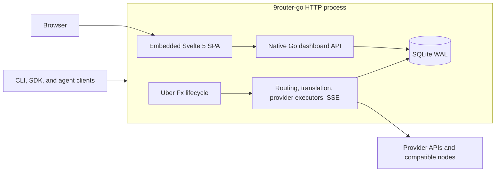
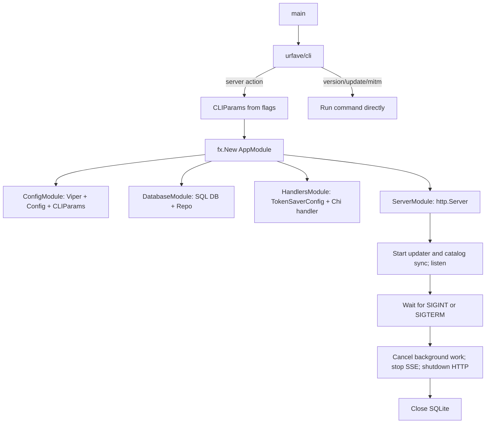
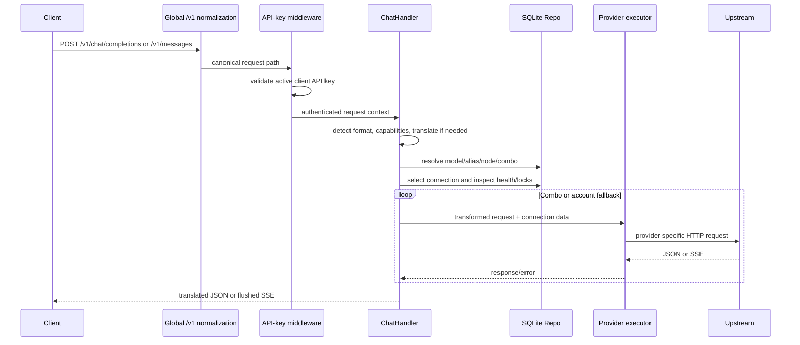

# 9router-go Architecture

This document describes the current Go implementation. Source code is authoritative when a compatibility statement and local behavior differ.

## Version and compatibility status

- Current Go release: **v1.9.1**, declared consistently by `VERSION`, `version.json`, and `internal/updater.CurrentVersion`.
- Declared upstream baseline: [`decolua/9router` v0.5.85](https://github.com/decolua/9router). The local checked-out upstream has `package.json` version `0.5.85` and a v0.5.85 changelog; published upstream npm/Docker `latest` is v0.5.86.
- Go v1.9.0 records selected upstream v0.5.86 parity work and explicitly deferred items in `CHANGELOG.md`. Those entries do not change the v0.5.85 manifest baseline or imply complete v0.5.86 parity.
- Upstream remains the compatibility reference. Its Next.js app and shared SSE core are historical sources for API, database, auth, and routing behavior. They are **not** the current Go runtime or dashboard.

“Parity” below means a specifically implemented contract, not a blanket claim of endpoint, provider, UI, or operational equivalence.

## System context



The Go binary owns proxy routing, dashboard APIs, auth, persistence, OAuth, media/search tools, usage tracking, and static dashboard serving. The Svelte SPA calls the Go API; it does not read SQLite directly.

## Repository boundaries

| Path | Responsibility |
| --- | --- |
| `cmd/9router-go/` | CLI parser, commands, signal handling, Fx start/stop |
| `internal/app/` | Fx modules, dependency graph, server and DB lifecycle |
| `internal/config/` | Viper/env configuration, data and database path resolution, JWT secret |
| `internal/handlers/` | Chi route composition, chat, media, OAuth, dashboard, SSO, usage |
| `internal/handlers/chat/` | Model resolution, combos, account fallback, translation, forwarding |
| `internal/providers/` | Provider catalog/configuration and model capabilities |
| `internal/proxy/executor/` | Provider-specific upstream adapters and stream handling |
| `internal/translator/` | OpenAI/Claude/Gemini request, response, and stream transformations |
| `internal/middleware/` | Request IDs, body limits, logging/path normalization, API/dashboard/admin auth |
| `internal/db/` | SQLite connection, repository queries, WAL and optional Go-only leases |
| `web/` | Svelte 5 + Vite + Tailwind dashboard |
| `web/embed.go` | Embeds `web/dist` and serves the SPA with index fallback |

## Fx lifecycle

`cmd/9router-go/main.go` builds an `urfave/cli` application. The default server action loads CLI parameters and starts `app.AppModule` with `fx.Replace(cliParams)`. Set `FX_LOGGING=true` to enable the console Fx logger; otherwise Fx logging is disabled.



Dependency order is config → database/repository → handler/server. `OnStart` has a 15-second budget and begins background updater/catalog-sync loops and `ListenAndServe`. Shutdown has a 20-second outer Fx budget. The HTTP hook disables keep-alives, cancels the shutdown context used by streams, allows 5 seconds for `http.Server.Shutdown`, then the database hook closes SQLite. A second signal exits immediately.

`app.Run` contains equivalent reusable signal handling, but the CLI entrypoint currently implements the same sequence directly in `runServer`.

## HTTP composition and `/v1` normalization

The root Chi router installs request IDs, a 10 MiB body limit, panic recovery, and request logging before route groups are mounted.

`RequestLogger` repeatedly removes leading `/v1/` segments from `r.URL.Path`:

```text
/v1/chat/completions ─┐
/v1/v1/chat/completions ─┴─► /chat/completions
```

This mutation occurs before the API-key and route middleware. It provides broad compatibility with both prefixed and canonical unprefixed paths. Route registration then provides selected explicit aliases such as `/v1/models`, `/api/v1/models`, and `/api/models`. This is path normalization, not a promise that every historical upstream path is implemented.

Route groups are deliberately distinct:

| Group | Middleware | Scope |
| --- | --- | --- |
| Public | none | `/health`, login shell, auth bootstrap endpoints, public OAuth callback landing page |
| Engine | `RequireApiKey` | Chat, model, media, OAuth execution, usage streams, compatibility APIs |
| Dashboard management | `RequireDashboardAuth` | Providers, nodes, combos, pools, keys, settings, OAuth setup, SSO checks |
| Admin | `RequireAdminAuth` | Health reset, update, shutdown |

`/dashboard` and `/dashboard/*` receive `RequireDashboardPage`, which redirects unauthenticated navigations to `/login` when login is required. Compatibility SPA aliases such as `/connections`, `/combos`, `/settings`, and `/usage` serve the shell directly; the SPA performs the client-side login state check. Management APIs remain server-protected.

## Authentication boundaries

### Client API keys

`RequireApiKey` accepts:

- `Authorization: Bearer <active-api-key>`
- `X-API-Key: <active-api-key>`
- `key` or `apiKey` query parameters only when the route path ends in `/stream`

Keys are looked up in `apiKeys`; missing, invalid, and inactive keys receive 401. This middleware protects the proxy/compatibility domain regardless of the dashboard `requireLogin` setting.

### Dashboard sessions

Dashboard login issues a 24-hour HS256 JWT in the httpOnly `auth_token` cookie. `JWT_SECRET` is used when set; otherwise a random secret is generated and stored in `$DATA_DIR/jwt-secret`.

A stored bcrypt dashboard password wins. If none is stored, `INITIAL_PASSWORD` is accepted; for compatibility, the Go implementation still accepts the well-known `123456` when `INITIAL_PASSWORD` is unset. A remote request using that compatibility default is refused a session until the password is changed or `INITIAL_PASSWORD` is configured. Local requests may use it temporarily.

`RequireDashboardAuth` allows access when login is disabled, a valid session is present, the local `x-9r-cli-token` is valid, or an active client API key is present. This is intentional upstream-compatible machine access.

The CLI token is deterministically derived from the persisted machine ID, CLI secret, and a fixed compatibility salt; only the derived value is compared.

### Admin boundary

Shutdown, update, health reset, and database export/import are “always protected”: they require a valid dashboard session or local CLI token and reject ordinary client API keys. Profiling is not mounted unless `PPROF_ENABLED=true`.

## Embedded dashboard

`web/embed.go` embeds `web/dist` into the Go executable. `web.Handler()`:

1. serves an existing embedded file;
2. returns 404 for a missing file-like path; and
3. falls back to `index.html` for extensionless SPA routes.

The Svelte app owns navigation among `/dashboard/...` views. Its typed client uses relative `/api`, `/v1`, `/usage`, and `/translator` requests. During development, Vite proxies those prefixes to a separately running Go server at `localhost:20130`.

There is no production Node.js process. Bun is still required at build time to install dependencies and produce `web/dist`. `make web-build` skips building when `web/dist/index.html` exists; use `FORCE=1 make web-build` after dashboard changes.

The dashboard was ported from the upstream Next.js/React UI to Svelte 5. Preserve its public browser routes and API payloads during changes; it is not source-compatible with the React component tree.

## Chat, provider, and SSE flow



### Request stages

1. **Normalize and authenticate.** Leading `/v1/` prefixes are removed and the client API key is checked.
2. **Parse client format.** OpenAI Chat Completions and Claude Messages have separate handlers. Claude requests are passed through for native Anthropic targets or converted toward OpenAI format otherwise.
3. **Resolve model.** Aliases, custom provider-node prefixes, model ownership, direct provider models, and combos are resolved from SQLite and the provider catalog.
4. **Apply routing.** Capability detection can reorder/float models. Combos select fallback, round-robin, sticky, or fusion behavior. Single models still enter account fallback.
5. **Select a connection.** Connections are ordered by priority/updated time and checked for active state, exclusions, strict model assignment, health, and per-model cooldowns.
6. **Prepare upstream request.** OAuth tokens are refreshed when expired, provider token formats are normalized, token savers apply, and provider-specific schemas/cloaking are added. Tool schemas are sanitized where required.
7. **Dispatch provider.** `NewChatHandler` registers provider executors. Registered adapters are dispatched first; Gemini-native and OpenAI-compatible defaults follow when no provider-specific executor exists.
8. **Stream or return JSON.** Streaming responses are copied incrementally or translated event-by-event. Each successful event is flushed; usage is captured in request-scoped state.
9. **Fail over safely.** Upstream errors are classified, retryable connections can be locked with exponential/cooldown state, and fallback stops once response headers are committed. A reactive 401 can refresh OAuth and retry once.
10. **Record telemetry.** Pending in-flight state is published live; completed requests update usage history/daily aggregates and the recent-request ring.

### Streaming guarantees and limits

- The default OpenAI-compatible forwarder checks the upstream content type. A requested stream that returns JSON is handled as JSON rather than blindly emitting an SSE header.
- `StallReader` bounds periods without upstream data. Client and shutdown contexts can also abort the body.
- Claude stream translation uses per-stream state and emits terminal framing when needed. Once headers/bytes are committed, upstream fallback cannot rewrite the response.
- Provider adapters can impose their own aggregation limits. A pure error event discovered only after an SSE stream is already committed can still close without a recoverable client error; non-stream paths surface these as errors.

## Routing details

### Combos

- **Fallback:** try candidates in order.
- **Round-robin:** rotate the starting position per request.
- **Sticky:** keep the current account/model until its configured consecutive-use limit.
- **Fusion:** run panel requests, apply quorum/straggler/hard timeouts, and ask a configured judge model to synthesize the result; insufficient panel answers degrade according to the handler contract.
- **Capability adapter:** scan the request for features such as tools, vision, or reasoning and prefer compatible candidates.

Combo state, provider connection state, health, and some settings are persisted in JSON-backed rows and scopes. Treat those payloads as compatibility surfaces.

### Error cooldown

Retryable upstream errors are classified from status and text. Capacity/rate-limit/overload conditions use exponential backoff; selected authentication/not-found conditions use longer cooldowns. Connection/model locks and backoff levels are written into `providerConnections.data`, and a success clears the selected lock. Exact thresholds are implementation policy, not a general upstream guarantee.

## SQLite compatibility and bootstrap limitation

`internal/db.OpenDatabase`:

- creates the parent directory;
- opens a `modernc.org/sqlite` database in WAL mode;
- enables foreign keys, a five-second busy timeout, normal synchronous mode, memory temp storage, and bounded connection settings;
- chmods the directory and database to user-only permissions where supported; and
- shares compatible rows/JSON payloads with upstream 9router.

`ProvideDatabase` creates only the Go-specific `upstream_leases` table with `CREATE TABLE IF NOT EXISTS`. Go does **not** create the full upstream schema, seed API keys/settings, import legacy JSON, or execute `_meta`-driven migrations. It is not safe to interpret an automatically created empty SQLite file as an initialized dashboard database.

Consequences:

- An existing upstream-compatible database is the supported starting point.
- A fresh Go volume or empty file is not a complete bootstrap path and can yield SQL errors on the first protected request.
- `DB_PATH` may point to a file. If it points to a directory, resolution recognizes `db/data.sqlite`, `data.sqlite`, or `9router.db` when present, otherwise it selects `db/data.sqlite`.
- There is no Go-side migration/backup transaction equivalent to upstream's schema migrator.
- Provider credentials are stored in the database; protect the file and volume as secrets.

`DATABASE.md` contains the schema inventory and known drift. Its Next.js labels are compatibility history, not a statement that Next.js is deployed with this binary.

## Background work and observability

On startup, the server starts:

- a six-hour background update checker when auto-update is enabled;
- model catalog synchronization to `model-catalog.json` beside the database; and
- a live console-log ring used by `/translator/console-logs/stream`.

The in-memory usage tracker publishes active requests over SSE and seeds recent history from `usageHistory` once per process. SQLite usage history remains the durable source. Daily usage aggregation is process-local merge plus full-row upsert; concurrent independent writers can still overwrite one another's daily aggregate.

Global middleware limits request bodies to 10 MiB, recovers panics, assigns request IDs, and emits structured request logs. `LOG_FILE` can redirect the standard logger to an append-only file.

## Build, test, and release contract

The project has two build-time toolchains: Bun builds the Svelte SPA, and Go embeds it and builds the executable. The committed `bun.lock` is the reproducible frontend dependency source; `go.mod` requires Go 1.27.

```bash
# Production build
FORCE=1 make web-build
make build

# Development runtime
make run                 # or: make dev
PORT=3000 DATA_DIR=/path make run

# Verification
make vet
make test-short          # go test ./...
make test                # go test ./... -v
```

CI uses Bun 1.4.2 to run `bun install --frozen-lockfile` and `bun run build`, then Go 1.27 to run `go vet ./...`, `go test ./... -v`, and a Go binary build. Tagged release workflow builds the five platform binaries with `make cross`, uploads checksums, and publishes multi-architecture Linux images. Docker builds the SPA in a Bun stage, embeds it into a CGO-disabled Go build, and runs the resulting binary in Alpine.

The web package has no frontend unit/component test script. Dashboard verification is therefore a running-server/browser exercise, while CI verifies TypeScript compilation during the Vite build plus the Go suites. The benchmark runner is a separate performance experiment, not an acceptance test.

## Current operational caveats

- **Fresh database:** Go does not bootstrap or migrate the full schema; initialize with a compatible database first.
- **Compatibility:** selected upstream contracts are ported, but v0.5.86 items in the changelog are partial and the declared baseline remains v0.5.85.
- **Network exposure:** the default listener is all interfaces. Set `HOST=127.0.0.1` behind a trusted reverse proxy or otherwise protect the port.
- **Dashboard security:** login is required by default when settings are missing/unreadable, but compatibility still accepts the well-known password locally until rotated. Set `INITIAL_PASSWORD` explicitly.
- **Profiling:** never enable `PPROF_ENABLED` on an untrusted network without separate access controls.
- **Secrets:** SQLite contains provider credentials; the local CLI secret and JWT secret also live under `DATA_DIR`.
- **Multi-process writes:** WAL improves concurrency, but daily aggregate full-row replacement and external process behavior still require care. Freebuff leases coordinate cooperating Go instances; they do not authorize policy-violating account sharing.
- **Build assets:** stale or missing `web/dist` can produce an unavailable dashboard or a compile-time embed failure. Release/CI always build the SPA first.
- **Provider reality:** cloaking and fallback improve compatibility but do not guarantee provider availability, quota, anti-ban safety, or permission to share accounts.
- **Updates:** release binaries are unsigned. Verify `SHA256SUMS.txt`; Windows may require explicit user action.

## Compatibility history and future work

The upstream project was a Next.js/React application with a JavaScript SSE/routing core and SQLite migrator. 9router-go ports the proxy behavior, selected data shapes, route/auth contracts, and dashboard behavior into a Go/Svelte single process. References to upstream Next.js code in comments and changelog entries identify provenance for a contract; they do not identify the current runtime.

Database migration/bootstrap support, frontend automated tests, additional unported upstream features, and parity gaps belong in `ROADMAP.md` or `TECHNICAL_DEBT.md` only as future work until implemented and verified.
