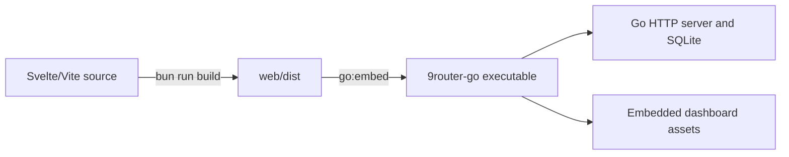

# 9router-go Native Embedded Dashboard: Build and Architecture Guide

This document describes the current native Go gateway and its embedded Svelte/Vite dashboard. It is a build and operations guide, not a feature-compatibility checklist. The current release metadata is `v1.9.1`; the repository manifest tracks upstream `v0.5.85`, while the changelog separately lists `v0.5.86` parity items. Do not treat those statements as a complete upstream-parity guarantee.

## Architecture

The Go process owns the HTTP server, SQLite repository, authentication, proxy handlers, and lifecycle. The dashboard is a Svelte 5 + TypeScript + Vite SPA. During a build, Vite writes optimized static files to `web/dist`; `web/embed.go` embeds `dist/*` into the Go executable. At runtime the browser receives the embedded files and calls the Go HTTP API.



Production does not need Node.js, Bun, or Vite after the binary is built. The generated `web/dist` directory is ignored by Git and may be absent in a fresh checkout. A Go build therefore needs the frontend prerequisites and a successful frontend build first. `go build` is not a self-sufficient substitute for that prerequisite.

## Prerequisites

Install the versions used by the repository before building:

- Go **1.27** (from `go.mod` and the release workflow).
- Bun **1.4.2** (from `.github/workflows/ci.yml` and `release.yml`).
- A writable `DATA_DIR`, or the default platform data directory (`~/.9router` on Unix-like systems, `%APPDATA%/9router` on Windows).
- Configuration for `JWT_SECRET` and `INITIAL_PASSWORD` when deploying. The application can generate a JWT secret when one is not supplied, but operators should set a strong value explicitly. Do not ship a known initial password.
- For optional release/cross-build work: the target Go toolchains and the platform-specific tools required by the selected build path. `RTK` is optional and is not required to build.

## Build the frontend

From the repository root:

```bash
cd web
bun install --frozen-lockfile
bun run lint
bun run build
cd ..
```

`bun run build` runs the TypeScript project build and Vite production build. It must produce at least `web/dist/index.html` and the referenced assets. The current `web/package.json` does not define a `test` script; do not document `bun run test` as an available build prerequisite. Frontend test automation is tracked in `ROADMAP.md` until the manifest and CI provide a test command.

`web/dist` is generated, not source. Remove or rebuild it when diagnosing stale assets:

```bash
rm -rf web/dist
cd web && bun install --frozen-lockfile && bun run build
```

## Build the Go binary

The normal path is the repository Makefile. It builds `web/dist` when it is missing, then embeds it and compiles the binary with the version from `VERSION` (or the documented fallback):

```bash
make build
```

`make web-build` is a prerequisite-only target. It runs `bun install --frozen-lockfile` and `bun run build` only when `web/dist/index.html` is missing or `FORCE=1` is set. It is not a substitute for an explicit frontend verification.

For a direct build, complete the frontend step first and then run:

```bash
test -f web/dist/index.html
go build -ldflags="-s -w -X '9router/proxy/internal/updater.CurrentVersion=$(cat VERSION)'" -o 9router-go ./cmd/9router-go
```

RTK may wrap the Go command in a developer environment, but it is optional and must not obscure failures from `go build`.

## Run and verify

Configure a data directory and secrets, then start the binary:

```bash
export DATA_DIR="$HOME/.9router"
export JWT_SECRET="$(openssl rand -hex 32)" # use a persistent, protected value in deployments
export INITIAL_PASSWORD='set-a-unique-local-password'
PORT=20130 ./9router-go
```

The server listens on `http://localhost:20130` by default. Check both the gateway and the embedded dashboard:

```bash
curl -i http://127.0.0.1:20130/health
curl -i http://127.0.0.1:20130/api/hello
curl -I http://127.0.0.1:20130/
```

With a fresh, valid embedded bundle, `/` and client-side dashboard routes return the SPA; missing asset paths return 404 rather than silently becoming HTML. Browser dashboard routes may redirect to `/login` when login is required. The login/session API is separate from the client API-key routes; do not infer authorization from the fact that a page loads.

Before using an existing SQLite file, verify that its schema is compatible with the current Go handlers. The Go database layer currently has an idempotent `upstream_leases` table bootstrap, not the full upstream versioned migration runner. Fresh-database schema bootstrap and legacy migration are therefore explicit hardening work in `ROADMAP.md`; this guide does not promise a no-action migration.

## Docker build

The Dockerfile is self-contained for a normal image build: its frontend stage installs Bun dependencies and builds `web/dist`, and the Go stage downloads modules and embeds the generated assets. It still requires network access to fetch Go and Bun modules, sufficient build resources, and a valid `VERSION` argument/fallback.

```bash
VERSION="$(cat VERSION)" docker build -t 9router-go .
```

The runtime image contains the Go binary and CA/time-zone support; it does not require a JavaScript runtime. Persistent application data must be mounted outside the container image and passed with `DATA_DIR`.

## Release and CI notes

CI currently builds the frontend, runs `go vet`, runs `go test ./...`, and builds the Go binary. It does not currently run a frontend test command, race detector, coverage gate, or release-time vulnerability scan. The release workflow builds cross-platform binaries and uploads `SHA256SUMS.txt`; its metadata must still be checked against `VERSION`, `version.json`, the tag, and changelog claims before publication.

For a release candidate, reproduce the relevant checks in a clean environment, record toolchain versions and the exact frontend build, and verify the embedded dashboard with a running binary. Do not report a successful frontend build as proof that a Go build, migration, auth boundary, or release artifact succeeded.
